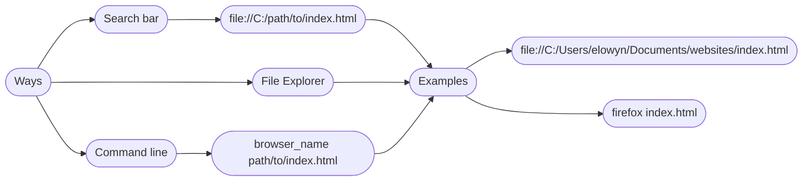

# Crazy CSS Pattern

This pattern is Crazy!

Better decrease page scale to 30% in your browser (basically ctrl -)
## Installation

Install Crazy-Css-Pattern with git

```bash
  git copy https://github.com/Yacinello-droid/Crazy-CSS-pattern
  cd CrazyCSSPattern
  firefox index.html
```
you can use any your browser name instead of `firefox`. Example: `google-chome index.html`

OR

Install required files from  (style2.css is not required)
## Changing style

To change style you can edit `<link rel="stylesheet" ref="style.css">` Change `ref="style.css"` to any css file name you want

Example: `<link rel="stylesheet" ref="MyOwnStyle.css">`

style should be in the same folder with index.html, but if it's not, you can write this instead: `ref="path/to/style.css"`

Example: `<link rel="stylesheet" ref="C:/Users/elowyn/Documents/Styles/NewStyle.css">`


## Opening

To open project you can just open it from file explorer or through your browser search bar

# Installation guide graph

```mermaid
graph LR
A(Ways) --> B(Releases)
A --> C(git)
C --> G(git clone "link to repository")
```

# Opening guide graph



Example: `file://path/to/project/index.html` This should work in Firefox and Google  Chrome
## Screenshots


